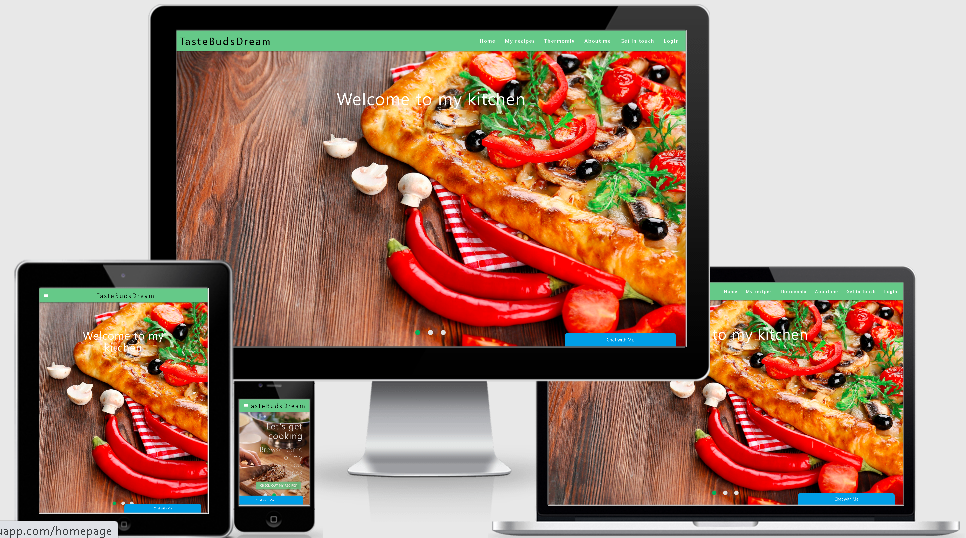
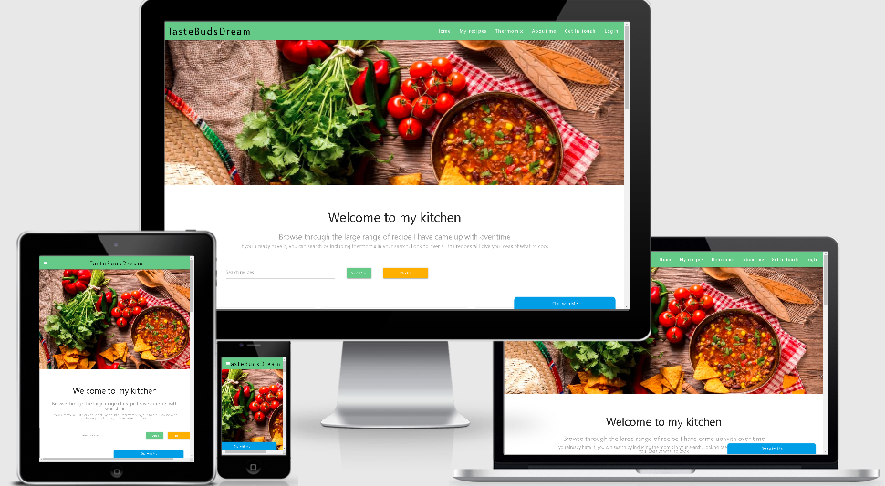
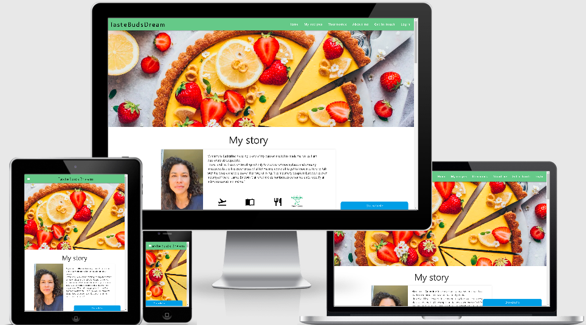
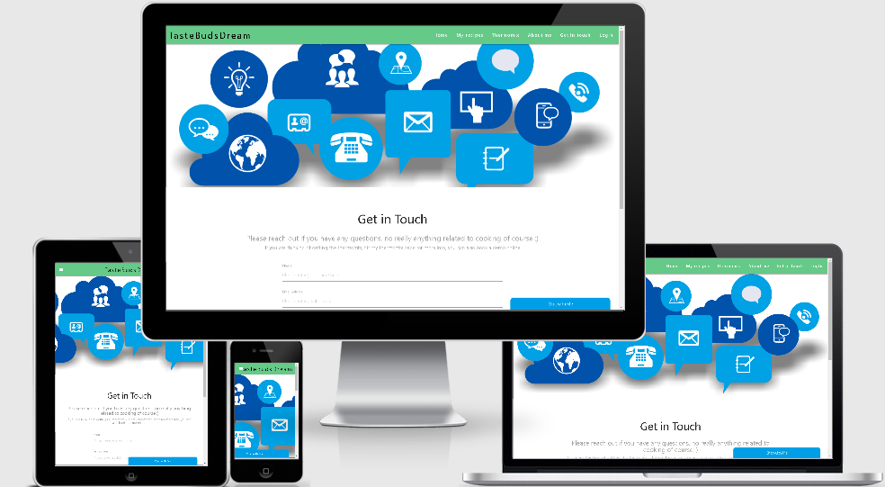
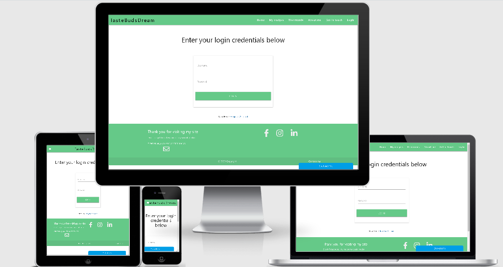

## Taste Buds Dream or TBD

-- What is TBD? --
TBD is for anyone who likes cooking: 
there is a large range a recipes, the public can read through and try themselves with.
The recipes are not only for regular home chef but also those who count the Thermomix appliance as part of their cooking appliance.
As opposed to other recipe site, where anyone can log in, edit, create, delete their recipes, TBD is a website dedicated to one user only, 
the owner, and is made for the public to enjoy looking at food, recipes and how they are made.
To sum up, anyone looking to spice up and level up their cooking style with or without the Thermomix should be interested in this site. 

**UX**

As a user, anyone whom enjoy cooking will first have the ability to search through a large range of recipes, those recipes are made for a certain number
of persons and have a preparation time displayed so to get better organised.
The search can either result in a thermomix or other type of recipe. Not restricting the user by selecting either/or will allow him/her to get inspired 
by any recipe instead of being specific unless they request so. In that case, the user is welcomed to use the 'thermomix' or 'other' criteria in their search.

The recipe cards provide a good bit of information to each user as a walkthrough to cook a specific meal. if however, a user is interested to
have it in writing, there is a download button offered to do so.

Apart from browsing each recipes or searching for a specific ingredients, type or category (vegan, gluten-free..), each
user can have a glimpse of what the thermomix offer. After all, the site owner is a thermomix advisor and want to share that experience with as many
potential customers as possible. 
Surfing through the thermomix page, a video welcomes the user, it is the official thermomix video and the owner's word on her own experience
will give a sense of similarity to the user.

Demos were available on site but since COVID19, the owner wants to set up live demos through Zoom which will be discussed in the feature for the future, but so far,
to get ahead and insite the visitors to come back, an agenda has been laid out on that page.

The About gives a good idea of whom the owner is and hope with those amazing characteristics: travel, culture, culinary experience, to be able to promote herself and 
the thermomix to convert traffic into demos lovers and eventually sales.

We are offering 2 ways for any user to contact the owner:
- a chat bubble which provides a sense of uniqueness to a recipe site but above all it brings it to a different level as any culinary or thermomix question can be answered
on the spot.
- a contact form, anyone not having the time to chat can leave a message which will be answered to at a later stage, however, the user gets a nice message letting him know that the owner
recieved his com.

That ends the first part of the site

The second part of the site is dedicated to the Creating, Editing, Deleting, Updating the recipes as well as encompasses the admin chat
It is very important to note at this stage the login holds a 'register' option for the purpose of the MS3 project required by the Code 
Institute, however this option will be delete as soon as the project is scored.

After logging in, the user has the option to:
--Edit an existing recipe which leads to updating it in the database or canceling the action which will bring her back to all the options view.
--Creating new recipe and saving it or reseting the form or cancelling this action which will bring her back to all options
--Deleting the existing recipe, a confirmation message will pop just to make sure it is the right action meant to be taken

--Creating a new category (vegan...) which leads to creating a new category or chosing editing category option
--Editing the existing categories will give her the option to delete them or edit if there is a typo. Upon deletion a confirmation message will pop up to make sure it 
is the right action meant to be taken.

--Opening the admin chat. As it is a one person owning the website, it is on her to control the admin chat. The only way to the admin chat is 
through the login. The chat admin will open in a new window, and it gives the option to choose which conversation to answer first.

Once all required changes are made, the owner can log out, a message will appear confirming that action.

## Wireframes
original wireframes:
https://wireframe.cc/pro/pp/44b628f31372825

## Features

Currently and as already discussed, TBD offers:

1 -- Search form: for any visitors to search by recipe name, ingredients, type(vegan...), thermomix or other
2 -- Recipe cards: offers a picture of the recipe in question, the recipe method, preparation time, number of people, type, category as well as a DOWNLOADABLE RECIPE CARD
3 -- Video: Thermomix official youtube video
4 -- Chat bubble and its admin chat: to interact directly with every user who wnats to discuss the site, a recipe, the thermomix
5 -- Email form: for anyone to reach out by email
6 -- login credentials to enter the CRUD capabilities
7 -- Registering option: which will be deleted as discussed above
8 -- CRUD capabilities:
        -- Creating, Deleting, Updating and Editing any recipes
        -- Creating, Deleting, Updating and Editing any categories (vegan..)
10 -- Log out
11 -- Live calendar
12 -- linking with social media

## Features Left to Implement

Interactive Calendar -- Zoom live demo integration
We will be looking in the near future to implement a Live Zoom Demo center in the site which will be linked to the calendar.
In fact, the calendar will show the Demo events, and we will give the ability for 5 lucky user to join. The demos are mainly thermomix centered.

Integrate with Facebook calendar as soon as it is completed to give more visibility to the site.

A possibility to change the number of people per meal so that the recipes ingredients align.

In a longer future: an eventual calorie counter will be added to the recipes

## Technologies Used

HTML, or Hyper Text Markup Language
CSS, or Cascading Style Sheets
Materialize
Javascript
Python
Werkzeug
Flask
Pusher
Pymongo
MongoDB
Cloudinary
Fullcalendar.io
Gitpod
Git
GitHub
Chrome DevTools
W3C Markup Validation Service
Heroku for deplyoment

## Testing

**http://ami.responsivedesign.is/** has been used to see how the site performs on different Apple devices and their viewports, all pages, links, icons performed as expected on all devices.

**Desktop**
Google Chrome, Internet Edge & Mozilla Firefox browsers; all pages, links on those pages, and footer icon links perform well on all viewport sizes. Developer tools were also used on 
all browsers for the various viewport sizes.

**Mobile**
used Huawei CLT-L09, Samsung Note 9, Iphone 4 and 5 to check every pages and links, all performs well on all devices.

**App testing**
Prior to the main testing, I had to test the app on heroku and constently have the debug on True in my app.py

First step taken was to set up the Mongodb database and decide on the collections and interactions of all.
Making my route to the database was the first test completed successfully as soon as flask was installed.

The second test was making sure all the secret keys were encoded in the environmental variable and also added into Heroku for deployment
The CRUD testing was run first through the terminal then after taking the select forms from materialize and setting up 2 new collections within Mongodb
I was able to test the ability to complete all of the CRUD capabilities with success.

For the search box, I had to create an index on my db through Python, once created and a quick look at mongodb to see if it showed, I created the search route and linked it to 
that index on my_recipes.

Prior to creating the pusher chat widget, I had created a separated gitpod workplace to test it out as it requires a lot of 'new knowledge'
As soon as in place and tested successfully I managed to install it again in this app just to find out it didnt work straight away which I explain further in issues.

Conducting test on registering a new user, by first creating a user collection on Mongodb and creating its route on flask and an html materialize form.
The user straight away appeared on mongodb which was a success and I could work on the login.

## Issues:

My main 'issue' was with github as everytime I started writing a Flask code, it would instantly disappear the next day if I started working pressing the green gitpod button.
A quick chat with the amazing tutors led me to understand that I should have gone to my workplace instead.

Some of the materialize col grid weren't working especiallyin the Iphone and Chrome, it was very hard to find the right combination for the parallax image
in my_recipes page as well as the video-card in the thermomix page. Couple of trials resulted in the current view.
The unstableness of flexbox in internet explorer has led me not to use a sticky footer but a fixed one. On the login page on mobile view we can 
clearly see the footer coming up more than it should.

I had a main issue with the chat widget as it didnt want to work at first, although my test was conducted on one page only. The issue lead within the secret keys and the scripts order:
pusher.min first followed by jquery and moment.js. But as soon as it worked I couldnt deploy the app with Heroku. A simple look at the variables made me realise that I hadn't properly
copy/pasted the pusher keys. As soon as done, the chat widget successfully worked.
The Chat bubble doesn't render well still on the Iphone only. It is responsive in every other display and align correctly. The next step will be contacting Pusher and asking for help.

The fullcalendar offers a drop and stick event to the calendar that I have currently hidden as the demos are not fixed yet.
Once the Demos are available, the calendar will reveal them in the different chosen dates.
I had a few issues with the fullcalendar, first regarding the version of the cdn, although clear, the documentation is a bit difficult to get when it came to choosing which cdn
and once the link pasted on my js, the devtool showed an error as: 'there is no _k attribute in main.min.js' which resulted in many online searches especially through stackoverflow,
at the end, I have had to change the order of my scripts many times to come up with the below: 
jquery first then main.js then calendar.js
The second issue occured when hidding the drag and drop in html, it triggered a calendar.js error which I resolved by commenting any code related to the drag and drop in the js file

## Deployment
Working with Github, the workplace is created and all files worked on gitpod.
Deployment was made with Heroku

create a heroku account, create an app and add all variables there.
First create a requirements.txt: pip3 freeze --local>requirements.txt
Then create Procfile: echo web: pyton app.py>Procfile
Followed by heroku ps:scale web=1 to scale the dynos

Login to heroku on gitpod
git add .
git commit -m "initial commit"
git: remote -a tbd-recipes

in heroku I connected my github tbd-recipes so to be able to deploy everytime I commit.

git push heroku master

## Credits
Credit to the API fullcalendar.io which was very easy to use and the walkthrough as well as demos easy to understand. Couple of 
codepens were visited to get inspired for the js code.

Full credit to the Pusher chat widget https://pusher.com/tutorials/chat-widget-python#prerequisites

w3schools for some hints on smoth scrolling top with href and id

Materialize vast components choice

## media
Am I Responsive web site for checking responsiveness on all Apple devices screen sizes; http://ami.responsivedesign.is/

https://stackoverflow.com/ w3schools Used as a resource for finding answers to all types of coding problems.

JSHint to check my javascripts codes

W3 validator to check html and css codes

## Acknowledgements

All of the Code institute members, Tutors, Student support!
My super mentor Adeye Adegbenga for his time, great advices and all the support provided to achieve this project.
My family for giving me the precious time to study, work on the projects and keep it up

